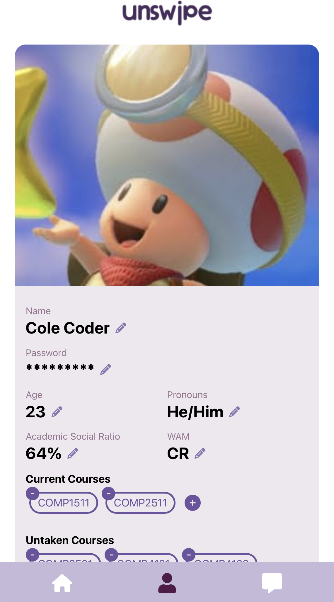

<br />
<div align="center">
	<a href="https://github.com/devsoc-unsw/trainee-uranus-24t1">
		
	</a>
	<h3 align="center">UNSWipe</h3>
	<p align="center">
		A web platform to find group project partners
		<br />
    <a href="https://swipe.chinosu.com">View Live App</a>
    ·
    <a href="https://github.com/devsoc-unsw/trainee-uranus-24t1/issues/new?labels=">Report Bug</a>
    ·
    <a href="https://github.com/devsoc-unsw/trainee-uranus-24t1/issues/new?labels=">Request Feature</a>
	</p>
</div>

## 🪴 1. Inspiration



DevSoc projects like Circles, Notangles and Unielectives take care of the hassle that comes with being a university student looking for courses to study ☝️🤓. But what if they want someone to work/study/hangout with in that course?

It is often difficult to find course partners/groups when everyone else you know has already completed the course before you. One can DM others for so long before they eventually submit themselves to the fact that they will have to settle for a stranger they know nothing about.😔

UNSWipe takes the hassle out of finding a suitable project partner/group by directing users through a UX flow similar to [Tinder](https://tinder.com/en-AU). Transparency is key when finding someone you'll actually enjoy working with. Like someone you see on the screen based on academic/social categories? Swipe right to match! 📲

## 📱 2. Design Prototype

To see our design prototype, visit our [Figma](https://www.figma.com/file/598iZKqDZZVRD0kDqqv55u/Figma-Design---"UN-SWipe"-1.0?type=design&node-id=0%3A1&mode=design&t=6IX7hiGUEd4AEZXU-1)!

## 📦 3. Built With
This app is made possible using the following frameworks.
* 
* 
* 
* 
* 
* 

## 💻 4. Getting started
Here are the steps set up the project locally.

**Prerequisites**
- npm
```
npm install npm@latest -g
```
- clone the repo
```
git clone git@github.com:devsoc-unsw/trainee-uranus-24t1.git
```

#### Backend

1. Install NPM packages
```
npm install
```

2. Fill out the `.env` file. A template is provided at `.env.example`

3. Start the server
```
npm run dev
```

#### Frontend

1. Install NPM packages
```
npm install
```

2. Update the `LOCAL_HOST` varible in `constants.ts` file depending on whether the frontend should connect to the local or remote backend.


3. Start the server
```
npm run dev
```

### Building
**Backend**

You can either build the backend with Docker, or use the following commands
```
npm run build  # Build the project
node src/index.js  # Run the project
npm run clean  # Remove transpiled code afterwards
```

**Frontend**
There is no Docker configuration for the frontend, so use the following commands
```
npm run build
npm run start
```

## 🌎 5. Deployment

The backend and frontend have been deployed, and you can interact with the app at [swipe.chinosu.com](https://swipe.chinosu.com). The app is made with mobile users in mind, so it will look a bit awkward on landscape devices.
